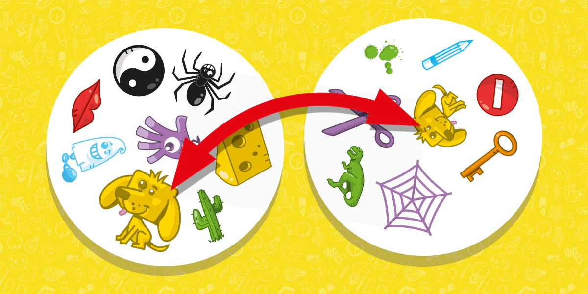

# Spot it!

Online game based on the popular card game Spot it! (also known as Dobble). The game is a semester project for the course *B0B39KAJ - Client applications in JavaScript* at the CTU in Prague.

## Overview:
Dobble is a simple pattern recognition game in which player tries to find an image shown on two cards.  Any two cards have exactly one symbol in common. The game is one-player and the player has to find the matching symbol and click on it on theirs card. Scores are based on the time taken to find the matching symbol.

## How to use:
On a home page you can see a menu with three buttons: Play, Scores, and Settings.
### Play a game 
1. Click on the "Play" button.
2. The game will show you two cards with symbols.
3. Find the matching symbol on the two cards.
4. Click on the matching symbol on *your* card (=*left* if cards are in a row, or *top* if they are in a column).
5. If you are correct, you will hear a sound and the game will show you a next card.
6. If you are wrong, you will hear a different sound, and shake animation will be shown on the wrong symbol.

### Display scores
1. Click on the "Scores" button on home page.
2. All scores will be displayed in a table (it is scrollable if there are too many scores).

### Settings
1. Click on the "Settings" button on home page.
2. You can change the number of cards (from 5 to 55), and the sound settings (on/off).
3. There is also a online status check. If you are online, you can see your geolocation coordinates and a random quote.

### Project requirements (in Czech):
| Požadavek | Komentář |
| --- | --- |
| Dokumentace | README.md |
| Validní použití HTML5 doctype | Otestováno na [validator.w3.org](https://validator.w3.org/) |
| Fungující v moderních prohlíčečích | Otestováno v Chrome, Safari, Firefox, Opera |
| Semantické značky | Použity značky jako `<h1>`, `<nav>`, `<button>`, `<q>`, `
`, `<aside>`, `<table>`, `<form>` atd. |
|Grafika - SVG / Canvas | Použity SVG ikony pro symboly na kartách + animace ohnostroje na konci hry |
| Média - Audio/Video | Použit zvukový efekt při správném/nesprávném vybrání symbolu a na konci hry |
| Formulářové prvky | Použit formulář v sekci Settings (počet karet, zvuk) |
| Offline aplikace | Při offline režimu se v sekci Settings zobrazí informace o offline režimu |
| Pokročilé selektory | Použity |
| Vendor prefixy | Použity pro blur efekt pozadí (-webkit-backdrop-filter) |
| CSS3 transformace 2D | Použity pro rozmístění symbolů na kartách, pro animaci ohnostroje na konci hry, animaci symbolů na kartách |
| CSS3 transitions/animations | Transitions pro tlačítka menu, animations pro ohnostroj na konci hry, animace symbolů na kartách |
| Media queries | Použity pro responzivní design, otestováno na mobilních zařízení a na laptopu |
| JavaScript - OOP | Použity třídy |
| Použití JS frameworku či knihovny | Ne |
| Použití pokročilých JS API | Použito Geolocation API pro zjištění polohy uživatele, Fetch API pro získání citátu, History API, Local Storage pro ukládání nastavení a skóre |
| Funkční historie | Ano |
| Ovládání medií | Ano, zvukové efekty ve hře a na konci hry |
| Offline aplikace | Ano, zobrazení informace o offline režimu v sekci Settings |
| JS práce se SVG | Ano, animace ohnostroje na konci hry |
